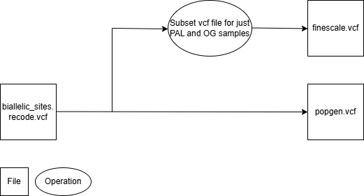

---
output:
  github_document:
knitr:
  opts_chunk:
    fig.path: "figures/"
---
# Variant filtering  

## Tools & manuals  
*vcftools* v0.1.16 [manual.](https://vcftools.github.io/man_latest.html)  

## Globally applied methodology  

### Remove indels (insertions and deletions)  
Remove indels using *vcftools* v0.1.16 function ```--remove-indels```, leaving only single nucleotide polymorphisms (SNPs).   
**Code**  
```bash
vcftools --gzvcf doris29_variants.vcf.gz --remove-indels --out $OUTPUT_DIR/rm_indels.vcf --recode --recode-INFO-all
```   
**Data loss**  
After filtering, kept 120429 out of a possible 123612 Sites.  

### Filter by missingness per sample  
No samples needed to be removed on the basis of missing data. All samples had low missing data, with the maximum missingness observed to be 5.35%.  
```{r sample_missingness, echo=FALSE, fig.path='figures/'}
setwd("G:/My Drive/Honours/Bioinformatics")
imiss <- read.table("missing_indv2.imiss", header = TRUE)

hist(imiss$F_MISS,
     breaks = 50,              # Number of bins
     main ="",
     xlab = "Proportion of missing variants (F_MISS)",
     ylab = "Number of individuals")

```  

### Filter by base quality  
Only sites with a minimum base quality score of 30 were retained, corresponding to base call error percentage of 0.1%.*Vcftools* v0.1.16 function ```--minQ 30``` was used.  

**Code**  
```bash
vcftools --vcf rm_indels.recode.vcf --minQ 30 --out $OUTPUT_DIR/rm_indels.vcf --recode --recode-INFO-all
```  
**Data loss**  
After filtering, kept 113042 out of a possible 120429 Sites.   

### Filter each site by depth
First, the mean depth of sites across all samples needs to be found, to determine both the upper and lower limits for filtering by depth. This was found using *vcftools* v0.1.16 function ```--site-mean-depth```.  

**Code**  
```bash
vcftools --vcf minQ30.recode.vcf --site-mean-depth --out $OUTPUT_DIR/meanDP

awk '{ total += $3 } END { print "Mean depth:", total/NR }' "$OUTPUT_DIR/meanDP.ldepth.mean"
```   
A mean depth of 48.44 was found. The lower limit will be 48.44/3 which is 16 and the upper limit will be 48.44*2 which is 97, both to the nearest whole number. This was done using *vcftools* v0.1.16 functions ```--min-meanDP 16``` and ```--max-meanDP 97```.  
**Code**  
```bash
module load vcftools
vcftools --vcf minQ30.recode.vcf --min-meanDP 16 --max-meanDP 97 --out $OUTPUT_DIR/site_depth --recode --recode-INFO-all
```   
**Data loss**
After filtering, kept 78505 out of a possible 113042 Sites.  
### Keep only biallelic sites
Keeps only variant sites in which only two alleles were found using *vcftools* v0.1.16 functions ```min-alleles 2``` and ```--max-alleles 2```.  
**Code**  
```bash
module load vcftools
vcftools --vcf site_depth.recode.vcf --min-alleles 2 --max-alleles 2 --out $OUTPUT_DIR/biallelic_sites --recode --recode-INFO-all
```  
**Data loss**  
After filtering, kept 73993 out of a possible 78505 Sites.  


## Population specific methodology

### Allocate localities to their corresponding samples  
Each sample was matched with their corresponding locality and the two outgroup samples similarly labelled as an outgroup.  
- PAL: Palmer Archipelago  
- LI: Low Island  
- BS: Bransfield Strait  
- KGI: King George Island  
- EI: Elephant Island  
- OG: Outgroup  

A locality.txt file was produced with two columns, the first representing the sample and the second locality such that:
RN02_L0001  PAL  
RN02_L0002  PAL  
RN03_L0003  PAL  
etc  

A .keep file (a plain text file) for each locality and their corresponding samples was produced with the use of a bash script. This returned the following files: PAL.keep, LI.keep, BS.keep, KGI.keep, EI.keep and OG.keep.  

**Code**
```
for pop in $(cut -f2 locality.txt | sort | uniq); do
    echo "Processing population: $pop"
    awk -v p=$pop '$2 == p' locality.txt > ${pop}.keep
done
```
### Determine site missingness per population

As samples were gathered from multiple localities, site missingness was calculated per population. This prevents the retention of sites that may have poor genotyping in one population but complete genotyping in all others. This is particularly important as 125/164 samples are from the Palmer Archipelago (PAL), as sites with poor genotyping within the minority localities would likely be retained if a global filter was applied. The outgroup samples (n=2) were excluded from these steps to prevent the inappropriate removal of divergent but informative loci. This was completed using *vcftools* v0.1.16 functions ```--keep``` and ```--missing-site```.  

```
vcftools --vcf biallelic_sites.recode.vcf --keep localities/PAL.keep --missing-site --out PAL
vcftools --vcf biallelic_sites.recode.vcf --keep localities/LI.keep --missing-site --out LI
vcftools --vcf biallelic_sites.recode.vcf --keep localities/BS.keep --missing-site --out BS
vcftools --vcf biallelic_sites.recode.vcf --keep localities/KGI.keep --missing-site --out KGI
vcftools --vcf biallelic_sites.recode.vcf --keep localities/EI.keep --missing-site --out EI
```

Most loci within each locality had an extremely low proportion of missing data, as seen plotted below.
```{r loci_missingness, echo=FALSE, fig.path='figures/'}
setwd("G:/My Drive/Honours/Bioinformatics")
lmiss_PAL <- read.table("PAL.lmiss", header = TRUE)
hist(lmiss_PAL$F_MISS,
     breaks = 50,              # Number of bins
     main = "Palmer Archipelago",
     xlab = "Fraction of missing genotypes (F_MISS)",
     ylab = "Number of Sites",
     xlim=c(0,1))

lmiss_LI <- read.table("LI.lmiss", header = TRUE)
hist(lmiss_LI$F_MISS,
     breaks = 50,              # Number of bins
     main = "Low Island",
     xlab = "Fraction of missing genotypes (F_MISS)",
     ylab = "Number of Sites",
     xlim=c(0,1))

lmiss_BS <- read.table("BS.lmiss", header = TRUE)
hist(lmiss_BS$F_MISS,
     breaks = 50,              # Number of bins
     main = "Bransfield Strait",
     xlab = "Fraction of missing genotypes (F_MISS)",
     ylab = "Number of Sites",
     xlim=c(0,1))

lmiss_KGI <- read.table("KGI.lmiss", header = TRUE)
hist(lmiss_KGI$F_MISS,
     breaks = 50,              # Number of bins
     main = "King George Island",
     xlab = "Fraction of missing genotypes (F_MISS)",
     ylab = "Number of Sites",
     xlim=c(0,1))

lmiss_EI <- read.table("EI.lmiss", header = TRUE)
hist(lmiss_EI$F_MISS,
     breaks = 50,              # Number of bins
     main = "Elephant Island",
     xlab = "Fraction of missing genotypes (F_MISS)",
     ylab = "Number of Sites",
     xlim=c(0,1))

```  
  
Given the low proportion of missingness per site in all populations, a conservative threshold for filtering can be applied. For each population, sites with at least 5% missingness will be determined. However, downstream analysis will require different data sets, specifically a data set of just PAL samples to look at fine scale dispersal and a data set of all samples to look at population genetics (both to include outgroups samples, n=2). Thus two lists of sites to remove will be created on the basis of locality.

```
#Sites to remove for PAL data set
awk 'NR > 1 && $6 > 0.05 { print $1, $2 }' PAL.lmiss > badsitesPAL.txt
#Sites to remove for popgen data set
awk 'FNR > 1 && $6 > 0.05 { print $1, $2 }' PAL.lmiss BS.lmiss LI.lmiss KGI.lmiss EI.lmiss | sort -k1,1 -k2,2n | uniq > badsitesALL.txt
```
Before site removal can occur, the data set needs to be subsetted so there are two subsequent data sets: one for fine scale dispersal and one for population genetics. This was completed using *vcftools* v0.1.16 function ```--keep```. The fine scale data set will include the two outgroup samples, as these may be necessary in further downstream analysis.  

  

**Code**  
```
#Merge PAL and OG .keep files to be used to subset the vcf file
cat PAL.keep OG.keep > PAL_OG.keep
#Create PAL dataset as a subset from all data
vcftools --vcf biallelic_sites.recode.vcf --keep localities/PAL_OG.keep --recode --recode-INFO-all --out PAL_OG_subset
```  

With two separate data sets, sites missingness >5% by population can now be removed using *vcftools* v0.1.16 function ```--exclude-positions```.  
**Code**  
```
#Sites removed for fine scale dispersal data set
vcftools --vcf finescale.recode.vcf --exclude-positions badsitesPAL.txt --recode --recode-INFO-all --out finescale_site_removed
#Sites removed for population genetics data set
vcftools --vcf biallelic_sites.recode.vcf --exclude-positions badsitesALL.txt --recode --recode-INFO-all --out popgen_site_removed
```  
**Data loss**  
*Fine scale dispersal data set:*  
After filtering, kept 73576 out of a possible 73993 Sites.  
*Population genetics data set:*  
After filtering, kept 72446 out of a possible 73993 Sites.  

### Filter sites by allele count 

As the aim is to detect relatedness on the order of kinship within the PAL samples, alleles will be filtered by count and not frequency. A minor allele count of 3 ensures SNPs detected occur in at least 2 individuals, preventing the removal of rarer biological informative variants that occur in low frequencies but very closely related individuals. To be consistent and allow the datasets to be comparable, a minor allele count of 3 will also be applied to the population genetics dataset. This was done using *vcftools* v0.1.16 function ```--mac 3```.  
**Code**  
```
#filtering by a minor allele count of 3 for fine scale dispersal data
vcftools --vcf finescale_site_removed.recode.vcf --mac 3 --recode --recode-INFO-all --out finescale_mac
#filtering by a minor allele count of 3 for population genetics data
vcftools --vcf popgen_site_removed.recode.vcf --mac 3 --recode --recode-INFO-all --out popgen_mac
```  
**Data loss**  
*Fine scale dispersal data set:*  
After filtering, kept 45809 out of a possible 73576 Sites.  
*Population genetics data set:*  
After filtering, kept 48349 out of a possible 72446 Sites.  

### Filter sites by maximum heterozygosity  

Heterozygosity for a biallelic SNP should theoretically be ≤0.5. Values > 0.5 may represent paralogous loci or multilocus contigs (ref: https://onlinelibrary.wiley.com/doi/full/10.1111/j.1755-0998.2010.02967.x). Therefore, sites with an observed heterozygosity >0.5 were found and removed from both data sets. This was done in R, using the packages ```adegenet``` and ```vcfr```.  

**Code**
```
Required R packages:  
#install.packages("adegenet")
#install.packages("vcfR")
library(adegenet)
library(vcfR)

#calculating site heterozygosity for fine scale dispersal data  

#import vcf file into R
vcf_finescale <- read.vcfR("finescale_siteID.vcf")
#convert vcf data into a genind object
finescale_genind <- vcfR2genind(vcf_finescale)
#summary statistics
summary_finescale = summary(finescale_genind)
summary_finescale$Hobs
#export site heterozygosity into a csv file
write.csv(summary_finescale$Hobs, file = "Finescale_Hobs_per_SNP.csv")


#calculating site heterozygosity for population genetics data  
vcf_popgen <- read.vcfR("popgen_siteID.vcf")
popgen_genind <- vcfR2genind(vcf_popgen)
summary_popgen = summary(popgen_genind)
summary_popgen$Hobs
write.csv(summary_popgen$Hobs, file = "Popgen_Hobs_per_SNP.csv")
```  
The exported .csv files can be then be sorted to delineate sites with an observed heterozygosity >0.5. From this data sorting step, two additional files were created: PALbadSNPs.txt and PopgenbadSNPs.txt. These files had the format <locus> and <position> which were tab delimited.  

**Code**  
```
#removing sites for fine scale data set  
vcftools --vcf finescale_mac.recode.vcf --exclude-positions PALbadSNPs.txt --recode --recode-INFO-all --out Finescale_max_het05  
#removing sites for population genetics data set  
vcftools --vcf popgen_mac.recode.vcf --exclude-positions PopgenbadSNPs.txt --recode --recode-INFO-all --out Popgen_max_het05   
```  
**Data loss**  
*Fine scale dispersal data set:*  
After filtering, kept 37870 out of a possible 45809 Sites.  
*Population genetics data set:*  
After filtering, kept 40542 out of a possible 48349 Sites.  

### Selecting one SNP per locus  
The last step of the variant filtering process involved selecting one SNP per locus. This reduces the potential for linkage disequilibrium, which occurs when nearby SNPs have a non random association. As many analyses treat each SNP as independent, their occurrence would lead to the inflated estimates of genetic variation in samples. This step required extracting all SNP identifications, and extracting the first one from each locus into a list that was then used to filter the .vcf file. 

**Code**
```
#Steps for fine scale data set.

#Extract a list of all SNP IDs from the vcf fil
grep -v "^#" Finescale_max_het05.recode.vcf | cut -f1,2 > Finescale_SNPs.tx
#Isolate the first SNP per locus into a text file
awk '!seen[$1]++' Finescale_SNPs.txt > Finescale_one_SNP_per_locus.txt
#Filter SNPs to keep one SNP per locu
vcftools --vcf Finescale_max_het05.recode.vcf --positions Finescale_one_SNP_per_locus.txt --recode --recode-INFO-all --out Finescale_SNPs

#Steps for population genetics data set.

#Extract a list of all SNP IDs from the vcf file
grep -v "^#" Popgen_max_het05.recode.vcf | cut -f1,2 > Popgen_SNPs.txt
#Isolate the first SNP per locus into a text file
awk '!seen[$1]++' Popgen_SNPs.txt > Popgen_one_SNP_per_locus.txt
#Filter SNPs to keep one SNP per locus
vcftools --vcf Popgen_max_het05.recode.vcf --positions Popgen_one_SNP_per_locus.txt --recode --recode-INFO-all --out Popgen_SNPs
```  
**Data loss**  
*Fine scale dispersal data set:*  
After filtering, kept 7164 out of a possible 37870 Sites.  
*Population genetics data set:*  
After filtering, kept 7165 out of a possible 40542 Sites.  


