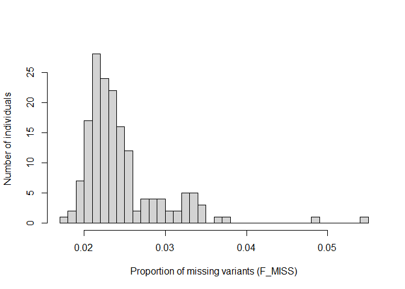

# Variant filtering

## Tools & manuals

*vcftools* v0.1.16 [manual.](https://vcftools.github.io/man_latest.html)

## Globally applied methodology

### Remove indels (insertions and deletions)

Remove indels using *vcftools* v0.1.16 function `--remove-indels`,
leaving only single nucleotide polymorphisms (SNPs).  
**Code**

``` bash
vcftools --gzvcf doris29_variants.vcf.gz --remove-indels --out $OUTPUT_DIR/rm_indels.vcf --recode --recode-INFO-all
```

**Data loss**  
After filtering, kept 120429 out of a possible 123612 Sites.

### Filter by missingness per sample

No samples needed to be removed on the basis of missing data. All
samples had low missing data, with the maximum missingness observed to
be 5.35%.  
<!-- -->

### Filter by base quality

Only sites with a minimum base quality score of 30 were retained,
corresponding to base call error percentage of 0.1%.*Vcftools* v0.1.16
function `--minQ 30` was used.

**Code**

``` bash
vcftools --vcf rm_indels.recode.vcf --minQ 30 --out $OUTPUT_DIR/minQ30.vcf --recode --recode-INFO-all
```

**Data loss**  
After filtering, kept 113042 out of a possible 120429 Sites.

### Keep only biallelic sites

Keeps only variant sites in which only two alleles were found using
*vcftools* v0.1.16 functions `min-alleles 2` and `--max-alleles 2`.  
**Code**

``` bash
module load vcftools
vcftools --vcf minQ30.recode.vcf --min-alleles 2 --max-alleles 2 --out $OUTPUT_DIR/biallelic_sites --recode --recode-INFO-all
```

**Data loss**  
After filtering, kept 106249 out of a possible 113042 Sites.

### Filter each site by depth

First, the mean depth of sites across all samples needs to be found, to
determine both the upper and lower limits for filtering by depth. This
was found using *vcftools* v0.1.16 function `--site-mean-depth`.

**Code**

``` bash
vcftools --vcf biallelic_sites.recode.vcf --site-mean-depth --out $OUTPUT_DIR/meanDP

awk '{ total += $3 } END { print "Mean depth:", total/NR }' "$OUTPUT_DIR/meanDP.ldepth.mean"
```

A mean depth of 48.1041 was found. The lower limit will be 48.1041/3
which is 16 and the upper limit will be 48.1041*2 which is 96, both to
the nearest whole number. This was done using *vcftools\* v0.1.16
functions `--min-meanDP 16` and `--max-meanDP 96`.  
**Code**

``` bash
module load vcftools
vcftools --vcf biallelic_sites.recode.vcf --min-meanDP 16 --max-meanDP 96 --out $OUTPUT_DIR/site_depth --recode --recode-INFO-all
```

**Data loss** After filtering, kept 73736 out of a possible 106249
Sites.

### Site missingness

Ordinarily, this filtering step would completed per population, to avoid
creating biases. However, only sites present in all samples will be
kept, eliminating the requirment to evaluate sites per population.
**Code**

``` bash
module load vcftools
vcftools --vcf site_depth.recode.vcf --max-missing 1.0 --out $OUTPUT_DIR/max_missing --recode --recode-INFO-all
```

**Data loss** After filtering, kept 68504 out of a possible 73736 Sites.

## Dataset specific filtering steps

The next steps will involve filtering for maximum observed
heterozygosity, minor allele frequency (MAF), and linkage
disequilibrium. However, the values of heterozygosity and MAF are
significantly influenced by the samples included in the dataset.
Therefore, future datasets where samples will be excluded (e.g., for
analysing kinship) will repeat the next filtering steps to account for
their unique combination of samples. In the first instance, a dataset
containing all individuals will be analysed.

### Filter sites by maximum heterozygosity

Heterozygosity for a biallelic SNP should theoretically be ≤0.5. Values
\> 0.5 may represent paralogous loci or multilocus contigs (ref:
<https://onlinelibrary.wiley.com/doi/full/10.1111/j.1755-0998.2010.02967.x>).
Therefore, sites with an observed heterozygosity \>0.5 were found and
removed. This was done in R, using the packages `adegenet` and `vcfr`.

**Code**

    setwd("G:/My Drive/Honours/population genetics")
    #install.packages("adegenet")
    #install.packages("vcfR")
    library(adegenet)
    library(vcfR)

    #import vcf file into R
    vcf_popgen <- read.vcfR("max_missing.recode.vcf")
    #convert vcf data into a genind object
    popgen_genind <- vcfR2genind(vcf_popgen)
    #summary statistics
    summary_popgen = summary(popgen_genind)
    summary_popgen$Hobs
    #export site heterozygosity into a csv file
    write.csv(summary_popgen$Hobs, file = "dataset1_Hobs_per_SNP.csv")

The exported .csv files can be then be sorted to delineate sites with an
observed heterozygosity \>0.5. From this data sorting step, two
additional files were created: PALbadSNPs.txt and PopgenbadSNPs.txt.
These files had the format <locus> and <position> which were tab
delimited.

**Code**

    #removing sites for fine scale data set  
    vcftools --vcf max_missing.recode.vcf --exclude-positions dataset1_badSNPs.txt --recode --recode-INFO-all --out max_het05  

**Data loss**  
After filtering, kept 60924 out of a possible 68504 Sites.

### Filter sites by minor allele frequency

Remove rare variants which might be spurious signals. A value of 0.05
was chosen which is typical for population genetic studies. This was
done using *vcftools* v0.1.16 function `--macf 0.05`.  
**Code**

    #filtering by a minor allele frequency of 0.05
    vcftools --vcf max_het05.recode.vcf --maf 0.05 --recode --recode-INFO-all --out maf_0.05

**Data loss**  
After filtering, kept 18333 out of a possible 60924 Sites.

### Selecting one SNP per locus

The last step of the variant filtering process involved selecting one
SNP per locus. This reduces the potential for linkage disequilibrium,
which occurs when nearby SNPs have a non random association. As many
analyses treat each SNP as independent, their occurrence would lead to
the inflated estimates of genetic variation in samples. This was
completed using the `--thin` function.

**Code**

    vcftools --vcf maf_0.05.recode.vcf --thin 500 --recode --recode-INFO-all --out dataset1

**Data loss**  
After filtering, kept 6063 out of a possible 18333 Sites.
