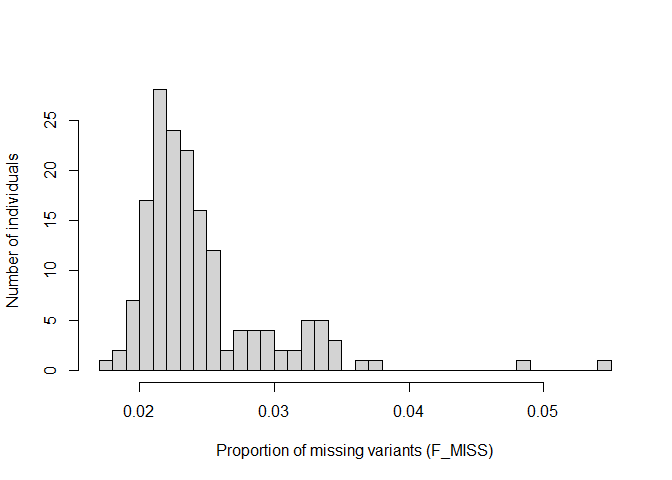

# Variant filtering

## Tools & manuals

*vcftools* v0.1.16 [manual.](https://vcftools.github.io/man_latest.html)

## Methodology

### Remove indels (insertions and deletions)

Remove indels using *vcftools* v0.1.16 function `--remove-indels`,
leaving only single nucleotide polymorphisms (SNPs).  
**Code**

``` bash
vcftools --gzvcf doris29_variants.vcf.gz --remove-indels --out $OUTPUT_DIR/rm_indels.vcf --recode --recode-INFO-all
```

\*\*Data loss\* After filtering, kept 120429 out of a possible 123612
Sites.

### Filter by missingness per sample

No samples needed to be removed on the basis of missing data. All
samples had low missing data, with the maximum missingness observed to
be 5.35%.

``` r
setwd("G:/My Drive/Honours/Bioinformatics")
imiss <- read.table("missing_indv2.imiss", header = TRUE)

hist(imiss$F_MISS,
     breaks = 50,              # Number of bins
     main ="",
     xlab = "Proportion of missing variants (F_MISS)",
     ylab = "Number of individuals")
```



### Filter by base quality

Only sites with a minimum base quality score of 30 were retained,
corresponding to base call error percentage of 0.1%.*Vcftools* v0.1.16
function `--minQ 30` was used.

**Code**

``` bash
vcftools --gzvcf doris29_raw.vcf.gz --minQ 30 --out $OUTPUT_DIR/rm_indels.vcf --recode --recode-INFO-all
```

**Data loss**  
After filtering, kept 113042 out of a possible 120429 Sites.

### Filter each site by depth

First, the mean depth of sites across all samples needs to be found, to
determine both the upper and lower limits for filtering by depth. This
was found using *vcftools* v0.1.16 function `--site-mean-depth`.

**Code**

``` bash
vcftools --vcf minQ30.recode.vcf --site-mean-depth --out $OUTPUT_DIR/meanDP

awk '{ total += $3 } END { print "Mean depth:", total/NR }' "$OUTPUT_DIR/meanDP.ldepth.mean"
```

A mean depth of 48.44 was found. The lower limit will be 48.44/3 which
is 16 and the upper limit will be 48.44*2 which is 97, both to the
nearest whole number. This was done using *vcftools\* v0.1.16 functions
`--min-meanDP 16` and `--max-meanDP 97`.  
**Code**

``` bash
module load vcftools
vcftools --vcf minQ30.recode.vcf --min-meanDP 16 --max-meanDP 97 --out $OUTPUT_DIR/site_depth --recode --recode-INFO-all
```

**Data loss** After filtering, kept 78505 out of a possible 113042
Sites.  
\### Keep only biallelic sites Keeps only variant sites in which only
two alleles were found using *vcftools* v0.1.16 functions
`min-alleles 2` and `--max-alleles 2`.  
**Code**

``` bash
module load vcftools
vcftools --vcf site_depth.recode.vcf --min-alleles 2 --max-alleles 2 --out $OUTPUT_DIR/biallelic_sites --recode --recode-INFO-all
```

**Data loss**  
After filtering, kept 73993 out of a possible 78505 Sites.
